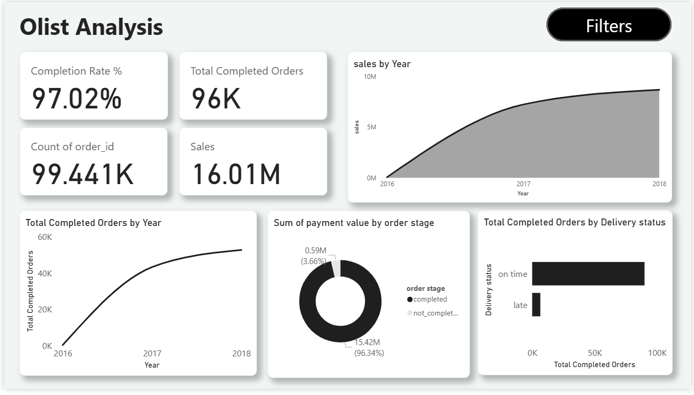

# 📦 Olist E-Commerce Analytics: Delivery & Retention
> **Project Goal:** Improving Revenue & Customer Loyalty by Optimizing Delivery Performance.

---

## 📄 Introduction
This project analyzes **100,000+ orders** from Olist (a Brazilian E-Commerce Marketplace). 
The main challenge is that Olist connects buyers and sellers, but unpredictable shipping leads to delays and customer dissatisfaction.

**My Role:** I acted as a Data Analyst to investigate why customers churn and how logistics performance directly impacts business growth.

---

## 📊 Dashboard Preview

---

## ❓ Business Questions
To solve the churn problem, I focused on answering:
1.  **Does delivery speed affect customer ratings?** (Is faster shipping worth the investment?)
2.  **How does a bad first experience impact loyalty?** (Retention analysis).
3.  **Where are the logistics bottlenecks?** (Specific sellers or regions).

---

## 💡 Key Insights

### 1. The "Late Delivery" Penalty
Data shows a drastic drop in satisfaction when orders are delayed:
* **On-Time Orders:** Average Rating = **4.5 / 5 Stars**.
* **Late Orders:** Average Rating drops to **2.5 / 5 Stars**.
* **Impact:** Late delivery causes an immediate **40% drop** in satisfaction.

### 2. First Impressions Define Loyalty
Retention analysis revealed:
* **89%** of returning customers had an **On-Time** delivery experience in their first order.
* A late first delivery almost guarantees the customer will never return.

### 3. The "Bad Apple" Sellers
* Top sellers maintain a delay rate under **4%**.
* A small group of underperforming sellers has a delay rate of **24%**, dragging down the platform's reputation.

### 4. Regional Bottlenecks
The **Northeast region** (e.g., Salvador) suffers the most, with delay rates reaching **25%**, significantly higher than the national average.

---

## 🚀 Strategic Recommendations

1.  **Enforce Seller SLAs:** Warning system for sellers with >10% delay rates.
2.  **Optimize Logistics in the Northeast:** Partner with local "last-mile" couriers in high-delay regions.
3.  **Manage Expectations:** Update "Estimated Delivery Date" dynamically for distant cities to avoid false promises.

---

## 🛠️ Tools & Skills
* **Python (Pandas):** Data cleaning & handling outliers.
* **SQL (T-SQL):** Complex queries for retention and seller segmentation.
* **Power BI:** Interactive dashboards (Payment Behavior & Delivery Performance).

---

## 📂 Project Structure
* `01_Data`: Cleaned datasets and raw data.
* `02_Notebooks`: Python code for cleaning.
* `03_SQL`: Analytical queries.
* `04_Dashboard`: Power BI exports (PDF & Screenshots).
* `05_Docs`: Full Executive Report.

---

### 👤 Author
**Mohamed Gomaa**
* [LinkedIn](https://www.linkedin.com/in/mohamed-gomaa-481780375)
